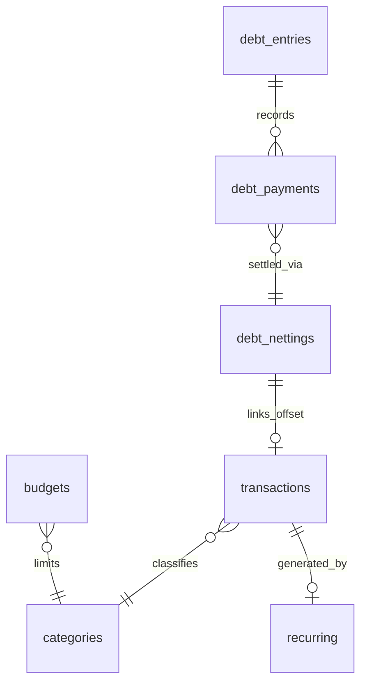
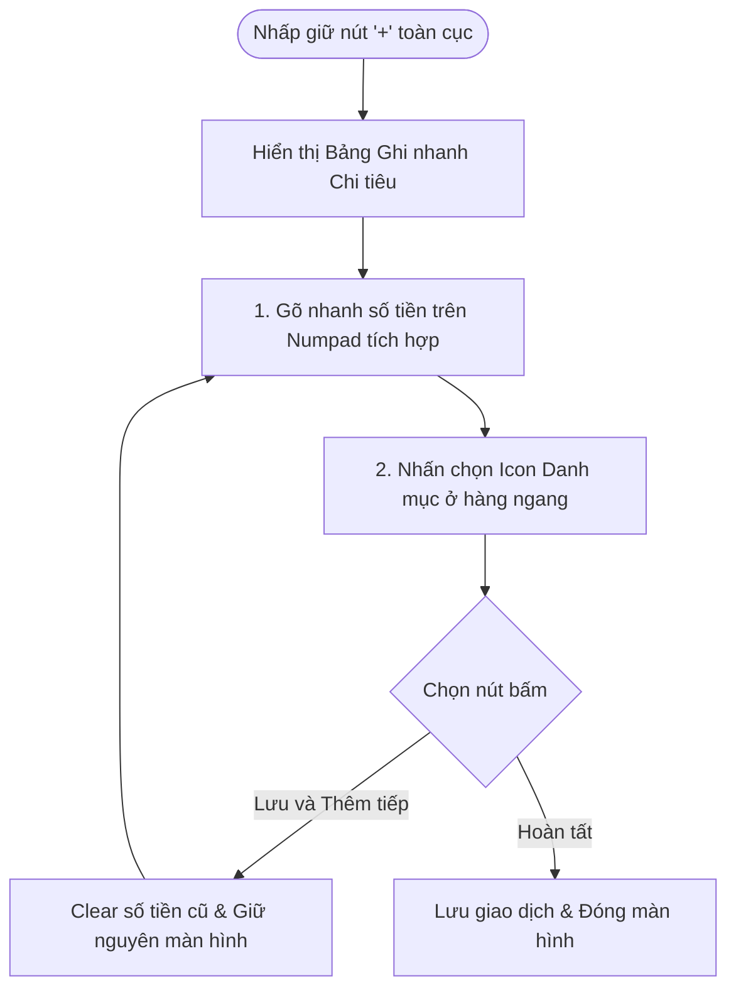

# TÀI LIỆU PHÂN TÍCH VÀ THIẾT KẾ CHI TIẾT: NÂNG CẤP MODULE QUẢN LÝ TÀI CHÍNH CÁ NHÂN (FINANCE V2)

**Tác giả:** Business Analyst (15+ năm kinh nghiệm trong lĩnh vực Fintech)  
**Tài liệu bổ sung theo yêu cầu:** Tích hợp Cấn trừ nợ tự động, Ghi nhanh chi tiêu nhỏ lẻ, Báo cáo Đa kỳ hạn (Ngày/Tuần/Tháng) & Quản lý ngân sách (Budget) chi tiết.

---

## 1. THIẾT KẾ CƠ SỞ DỮ LIỆU CHI TIẾT (DATABASE DESIGN)

Để đáp ứng các yêu cầu nghiệp vụ mới, cơ sở dữ liệu SQLite cần được bổ sung cấu trúc để quản lý việc **Cấn trừ nợ chéo tự động** và **Quản lý ngân sách theo kỳ hạn linh hoạt (Tuần/Tháng)**.



### 1.1 Bổ sung bảng: `debt_nettings` (Quản lý các đợt cấn trừ nợ chéo)

Khi thực hiện đối trừ nợ của cùng một đối tác A (hoặc cấn trừ khoản cho vay lấy tiền cấn vào nợ chi tiêu thực tế), hệ thống tạo 1 bản ghi netting và ánh xạ các bản ghi thanh toán nợ tương ứng về đây.

- `id` (TEXT, PK, NOT NULL): Mã định danh đợt cấn trừ.
- `user_id` (TEXT, Nullable): Phục vụ multi-user.
- `party` (TEXT, NOT NULL): Tên đối tác thực hiện đối trừ nợ.
- `amount` (INTEGER, NOT NULL): Số tiền đối trừ (ví dụ: cấn trừ tối đa `2.000.000 ₫` từ khoản vay chéo).
- `date` (INTEGER, NOT NULL): Ngày thực hiện cấn trừ (Epoch-ms).
- `note` (TEXT, Nullable): Ghi chú (ví dụ: "Cấn trừ nợ vay mua đồ ăn hộ đối với khoản nợ A").
- `created_at` (INTEGER, NOT NULL): Thời gian tạo bản ghi.

### 1.2 Cập nhật bảng: `debt_payments` (Nhật ký thanh toán nợ)

Thêm cột để biết đợt thanh toán này được thực hiện bằng tiền mặt (Cash/Bank) hay do đối trừ tự động.

- `payment_method` (TEXT, NOT NULL DEFAULT 'cash'): Phương thức thanh toán (`cash` | `netting`).
- `linked_netting_id` (TEXT, Nullable, FK): Liên kết tới bảng `debt_nettings` nếu thanh toán này thuộc một đợt cấn trừ nợ.

### 1.3 Cập nhật bảng: `budgets` (Hạn mức ngân sách đa kỳ hạn)

Nâng cấp bảng `budgets` từ chỉ quản lý theo tháng sang quản lý linh hoạt cả theo **Tuần** và **Tháng**.

- `period` (TEXT, NOT NULL DEFAULT 'monthly'): Kỳ hạn ngân sách (`weekly` - Tuần | `monthly` - Tháng).
- `target_period` (TEXT, NOT NULL): Giá trị thời gian.
  - Định dạng tháng: `YYYY-MM` (ví dụ: `2026-07`).
  - Định dạng tuần: `YYYY-Wxx` (ví dụ: `2026-W28` là tuần thứ 28 của năm 2026).
- _Chú ý:_ Đổi chỉ mục duy nhất thành `idx_budgets_category_period_target` trên các cột: `(categoryId, period, target_period)`.

---

## 2. LUỒNG NGHIỆP VỤ CHI TIẾT (BUSINESS FLOWS)

### 2.1 Nghiệp vụ cấn trừ nợ tự động (Debt Netting Flow)

#### A. Luồng chính (Main Flow):

1. **Kiểm tra điều kiện:** Khi người dùng mở chi tiết công nợ với đối tác "Huy Hoàng", hệ thống tự động kiểm tra xem có tồn tại song song cả khoản vay (`borrow`) và khoản cho vay (`lend`) với đối tác này ở trạng thái `Active` hay không.
2. **Đề xuất cấn trừ:** Nếu có, hệ thống hiển thị nút **"Cấn trừ nợ tự động"**.
3. **Tính toán số dư cấn trừ:** Hệ thống lấy giá trị nhỏ hơn giữa tổng số tiền đang đi vay và đang cho vay đối tác đó để làm số tiền đối trừ tối đa ($A_{\text{net}} = \min(D_{\text{vay}}, D_{\text{cho vay}})$).
4. **Xác nhận:** Người dùng nhập số tiền muốn cấn trừ (mặc định hiển thị $A_{\text{net}}$) và nhấn "Xác nhận".
5. **Ghi nhận Hệ thống:**
   - Hệ thống tạo 1 bản ghi trong bảng `debt_nettings` với số tiền cấn trừ.
   - Tạo 1 bản ghi `debt_payments` giảm dư nợ bên khoản đi vay (`borrow`), cột `payment_method = 'netting'`, gắn `linked_netting_id`.
   - Tạo 1 bản ghi `debt_payments` giảm dư nợ bên khoản cho vay (`lend`), cột `payment_method = 'netting'`, gắn `linked_netting_id`.
   - Nếu dư nợ sau cấn trừ của khoản nào bằng `0`, tự động cập nhật trạng thái khoản đó sang `paid`.

```
Ví dụ thực tế:
Bạn đang nợ Hoàng 5.000.000 ₫. Bạn cho Hoàng vay 2.000.000 ₫.
-> Thực hiện cấn trừ tự động tối đa: 2.000.000 ₫.
Kết quả sau cấn trừ:
- Khoản nợ Hoàng giảm còn 3.000.000 ₫ (Trạng thái: Active).
- Khoản Hoàng nợ bạn giảm về 0 ₫ (Trạng thái: Paid).
- Không phát sinh dòng tiền thực tế chạy qua ví.
```

---

### 2.2 Nghiệp vụ ghi nhận chi tiêu lặt vặt hàng ngày (Daily Petty Cash Tracking Flow)

Thiết kế luồng giúp tối ưu hóa thao tác người dùng: **mất dưới 3 giây để nhập một giao dịch nhỏ lẻ**.



- **Alternate Flow (Gợi ý thông minh):** Hệ thống đề xuất sẵn các số tiền lặt vặt phổ biến bằng các thẻ nhấn nhanh (ví dụ: `5.000 ₫` gửi xe, `15.000 ₫` bánh mì, `30.000 ₫` cà phê). Người dùng chỉ cần chạm nút tiền và chạm danh mục là hoàn tất giao dịch.

---

### 2.3 Nghiệp vụ báo cáo chi tiêu và đối soát ngân sách (Reporting & Budget Alert Flow)

1. **Tổng hợp dữ liệu theo ngày:** Mỗi giao dịch phát sinh được lưu kèm ngày chính xác.
2. **Tổng hợp theo tuần:** Hệ thống nhóm các giao dịch từ Thứ Hai đến Chủ Nhật của tuần hiện tại, tính tổng chi thực tế ($E_{\text{week}}$).
3. **Tổng hợp theo tháng:** Hệ thống nhóm các giao dịch từ ngày 1 đến ngày cuối tháng, tính tổng chi thực tế ($E_{\text{month}}$).
4. **Đối soát ngân sách:**
   - Hệ thống lấy ngân sách tuần ($B_{\text{week}}$) và ngân sách tháng ($B_{\text{month}}$) tương ứng.
   - So sánh tỷ lệ sử dụng ngân sách: $P = (E / B) \times 100\%$.
   - **Mức 1 ($P < 80\%$):** Trạng thái an toàn (Hiển thị màu xanh thanh nhã).
   - **Mức 2 ($80\% \le P < 100\%$):** Trạng thái cảnh báo sớm (Hiển thị màu vàng ấm áp, khuyến nghị thắt chặt chi tiêu).
   - **Mức 3 ($P \ge 100\%$):** Vượt ngân sách (Hiển thị màu đỏ cảnh báo, hiển thị số tiền bị âm).

---

## 3. THIẾT KẾ GIAO DIỆN HIỂN THỊ ĐỀ XUẤT (UI/UX WIREFRAMES)

Giao diện được thiết kế theo phong cách **Tài chính Neon cao cấp** (Sử dụng nền màu tối sâu đậm của kim loại quý kết hợp với ánh sáng dịu nhẹ mang sắc Cyber Cyan, Amethyst Purple và Emerald Green).

### 3.1 Màn hình Báo cáo & Theo dõi Chi tiêu đa kỳ hạn (Day/Week/Month Report)

Màn hình này sử dụng các Tab chuyển đổi nhanh ở phía trên.

```
+-------------------------------------------------------------+
|  < BÁO CÁO CHI TIÊU                                         |
|  [ Ngày ]               [[ TUẦN ]]                [ Tháng ] |
+-------------------------------------------------------------+
|  TUẦN NÀY (06 Th07 - 12 Th07, 2026)                        |
|  Tổng chi tiêu: 3.420.000 ₫                                 |
|                                                             |
|  +-------------------------------------------------------+  |
|  |  NGÂN SÁCH TUẦN NÀY                                   |  |
|  |  Hạn mức: 4.000.000 ₫                                 |  |
|  |                                                       |  |
|  |  [========================================......] 85% |  |
|  |  Đã chi: 3.420.000 ₫            Còn lại: 580.000 ₫    |  |
|  |                                                       |  |
|  |  ⚠️ Cảnh báo: Bạn đã tiêu hết 85% hạn mức tuần.        |  |
|  |     Khuyến nghị giảm chi tiêu ăn uống cuối tuần.      |  |
|  +-------------------------------------------------------+  |
|                                                             |
|  BIỂU ĐỒ CHI TIÊU HÀNG NGÀY TRONG TUẦN                      |
|                                                             |
|  800k |      #                                              |
|  400k |      #   #       #   #   #                          |
|  200k |  #   #   #   #   #   #   #                          |
|    0k +--+---+---+---+---+---+---+--->                      |
|          T2  T3  T4  T5  T6  T7  CN                         |
|                                                             |
|  DANH MỤC TIÊU DÙNG NHIỀU NHẤT                              |
|  1. Ăn uống  (Cam)   : 1.800.000 ₫ [========] 52%           |
|  2. Đi lại   (Xanh)  :   500.000 ₫ [==] 14%                 |
|  3. Giải trí (Tím)   :   450.000 ₫ [==] 13%                 |
+-------------------------------------------------------------+
```

---

### 3.2 Màn hình Nhập nhanh chi tiêu lặt vặt (Petty Cash Numpad)

Giao diện ghi nhanh dạng Modal hiển thị đè lên màn hình chính khi chạm vào biểu tượng "Sét chi tiêu" hoặc giữ nút "+".

```
+-------------------------------------------------------------+
| [X] CHI TIÊU NHANH HÀNG NGÀY                                |
|                                                             |
|  Số tiền: [ 35.000             ₫ ]                          |
|  Gợi ý:  [ 5k gửi xe ]  [ 15k bánh mì ]  [[ 35k Cà phê ]]    |
|                                                             |
|  DANH MỤC:                                                  |
|  ( Ăn uống )*   ( Đi lại )   ( Mua sắm )   ( Nhà cửa )      |
|  ( Giải trí )   ( Hóa đơn )  ( Làm đẹp )   ( Khác... )      |
|                                                             |
|  BÀN PHÍM SỐ:                                               |
|     [ 1 ]           [ 2 ]           [ 3 ]                   |
|     [ 4 ]           [ 5 ]           [ 6 ]                   |
|     [ 7 ]           [ 8 ]           [ 9 ]                   |
|     [ . ]           [ 0 ]           [ C ]                   |
|                                                             |
|  +---------------------------+ +--------------------------+  |
|  |     LƯU & THÊM TIẾP       | |         HOÀN TẤT         |  |
|  +---------------------------+ +--------------------------+  |
+-------------------------------------------------------------+
```

---

### 3.3 Màn hình Quản lý đối trừ nợ (Debt Netting Interface)

Nằm trong phân hệ Sổ nợ, cho phép xử lý nhanh giao dịch đối trừ.

```
+-------------------------------------------------------------+
|  < HỒ SƠ NỢ: HUY HOÀNG                                      |
+-------------------------------------------------------------+
|  TỔNG QUAN SONG PHƯƠNG                                      |
|  - Bạn đang cho Hoàng vay:  2.000.000 ₫                      |
|  - Bạn đang vay từ Hoàng :  5.000.000 ₫                      |
|  ---------------------------------------                    |
|  Dư nợ thực tế (Net):       3.000.000 ₫ (Bạn nợ Hoàng)      |
|                                                             |
|  ⚡ PHÁT HIỆN KHOẢN VAY CHÉO!                                |
|  Hệ thống phát hiện bạn có thể cấn trừ tối đa 2.000.000 ₫   |
|  để rút gọn sổ sách ghi nợ giữa hai bên.                    |
|                                                             |
|  Số tiền đối trừ: [ 2.000.000           ₫ ]                 |
|  Ghi chú: [ Cấn trừ nợ vay chéo tự động                   ] |
|                                                             |
|  +-------------------------------------------------------+  |
|  |                 XÁC NHẬN CẤN TRỪ TỰ ĐỘNG              |  |
|  +-------------------------------------------------------+  |
|                                                             |
|  LỊCH SỬ ĐỐI TRỪ & GIAO DỊCH                                |
|  - 07/07/2026: Vay gốc 5.000.000 ₫                          |
|  - 05/07/2026: Cho vay gốc 2.000.000 ₫                      |
+-------------------------------------------------------------+
```
